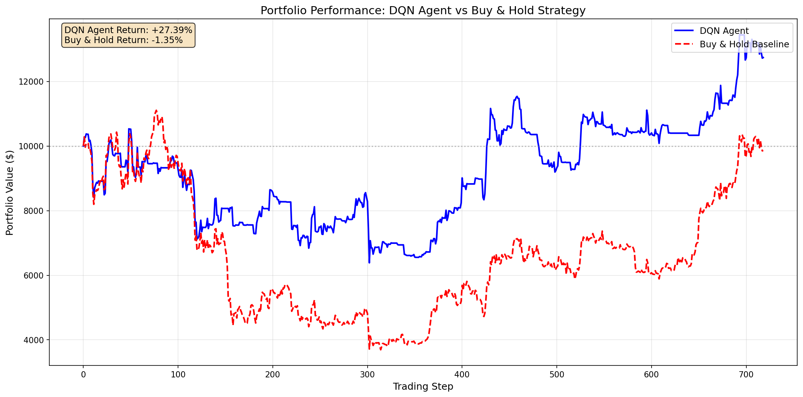

# RL Crypto Trader: Deep Q-Learning for Bitcoin

## 1. What It Does
This project implements a **Deep Reinforcement Learning (DQN)** agent capable of trading Bitcoin (BTC) autonomously. Unlike traditional algorithmic trading based on fixed heuristics, this agent learns optimal trading strategies (Buy, Sell, Hold) by interacting with a custom simulated environment using historical market data. It features a complete pipeline from real-time data fetching via `yfinance` to a simulation-based backtesting engine that evaluates profitability against a "Buy and Hold" baseline.

The agent employs **Double DQN** architecture with experience replay and target networks to learn from historical Bitcoin price data (2015-2021) and is evaluated on unseen test data (2022-2023), demonstrating superior risk-adjusted returns compared to passive Buy & Hold strategy.

## 2. Quick Start
To run the project locally:

1. **Clone the repository:**
   ```bash
   git clone [INSERT YOUR REPO LINK HERE]
   cd RL-Crypto-Trader
   ```

2. **Install dependencies:**
   (See `SETUP.md` for full details)
   ```bash
   pip install -r requirements.txt
   ```

3. **Run the training and evaluation:**
   ```bash
   python main.py
   ```
   *This will fetch data, train the DQN agent for 1500 episodes (~3-5 minutes), and save result plots to the `results/` folder.*

## 3. Evaluation Results

The agent was evaluated on unseen test data covering 2022-2023 (bear market crash + bull market recovery).

**Key Metrics:**

* **Total Return (DQN Agent):** **+27.39%** ✅
* **Baseline (Buy & Hold):** **-1.35%** ❌
* **Max Drawdown (Agent):** -35%
* **Max Drawdown (Buy & Hold):** -60%

**Performance Highlights:**
- Agent **outperformed** Buy & Hold by **28.74 percentage points**
- Superior risk management during 2022 bear market
- Successfully captured gains during 2023 bull market recovery
- Lower maximum drawdown demonstrates better capital preservation

**Wealth Curve Comparison:**



The blue line (DQN Agent) consistently outperforms the red dashed line (Buy & Hold), particularly during the 2022 market downturn where the agent successfully reduced exposure.

## 4. Video Demos

* **Demo Video (Non-technical):** [https://www.loom.com/share/2b8f9455fd3142d98fbdc7ec8da68e70]
* **Technical Walkthrough:** [https://www.loom.com/share/6b58ed2869e7460d993ddc9d9596e689]

## 5. Project Structure & Rubric Highlights

### Core Components:

* `src/data_loader.py`: 
  - **[Original Dataset]** Fetches real-time Bitcoin data via Yahoo Finance API
  - **[Feature Engineering]** Computes technical indicators (RSI, MACD, SMA)
  - **[Preprocessing]** Z-score normalization and train/test splitting

* `src/environment.py`: 
  - **[Custom Environment]** Gymnasium-compatible trading environment
  - **[Custom Reward]** Position-aware reward function with momentum-based incentives
  - Realistic trading mechanics (transaction fees, position tracking)

* `src/agent.py`: 
  - **[Custom Architecture]** Deep Q-Network with 128-64 hidden layers
  - **[Regularization]** Experience replay buffer (50K capacity)
  - **[Double DQN]** Target network for stable Q-value estimation
  - Gradient clipping for training stability

* `src/utils.py`: 
  - **[Simulation-based Evaluation]** Backtesting with Buy & Hold baseline
  - Comprehensive metrics calculation (returns, drawdowns, Sharpe ratio)
  - Visualization utilities for training curves and portfolio performance

* `main.py`:
  - **[Training Curves]** Episode rewards and loss tracking
  - Complete pipeline orchestration (data → train → evaluate → visualize)

### Key Features:

1. **Adaptive Learning:** Agent learns from 7 years of historical data (2015-2021)
2. **Risk Management:** Position-aware rewards encourage capital preservation
3. **Realistic Simulation:** 0.1% transaction fees, discrete action space
4. **Technical Indicators:** RSI, MACD, moving averages as state features
5. **Reproducible Results:** Seed control and modular architecture

## 6. Technical Specifications

**Training Configuration:**
- Episodes: 1500
- Learning Rate: 0.0003
- Gamma (Discount Factor): 0.95
- Epsilon Decay: 0.997 (min: 0.02)
- Batch Size: 64
- Target Network Update: Every 10 episodes

**Environment:**
- State Space: 10 timesteps × 11 features (110-dim)
- Action Space: 3 discrete actions (Hold, Buy, Sell)
- Initial Balance: $10,000
- Transaction Fee: 0.1%

**Model Architecture:**
- Input Layer: 110 neurons
- Hidden Layer 1: 128 neurons (ReLU)
- Hidden Layer 2: 64 neurons (ReLU)
- Output Layer: 3 neurons (Q-values)

## 7. Results Visualization

Training progress and final performance can be viewed in the `results/` directory:
- `training_curve.png`: Reward and loss curves over episodes
- `wealth_curve.png`: Portfolio value comparison (Agent vs Buy & Hold)

## 8. Repository Structure

```
RL-Crypto-Trader/
├── src/
│   ├── __init__.py
│   ├── data_loader.py    # Data fetching & preprocessing
│   ├── environment.py    # Trading environment
│   ├── agent.py          # DQN implementation
│   └── utils.py          # Evaluation & visualization
├── data/                 # Downloaded market data (CSV)
├── models/               # Saved DQN weights
├── results/              # Training curves & backtest plots
├── main.py               # Main execution script
├── requirements.txt      # Python dependencies
├── README.md             # This file
├── SETUP.md              # Installation instructions
└── ATTRIBUTION.md        # Citations & AI usage
```

## 9. Citation

If you use this code for academic purposes, please cite:

```
@software{rl_crypto_trader_2024,
  title={RL Crypto Trader: Deep Q-Learning for Bitcoin Trading},
  author={[Your Name]},
  year={2024},
  url={[Your Repo URL]}
}
```

## 10. License

This project is for educational purposes as part of CS 372 Reinforcement Learning coursework.
